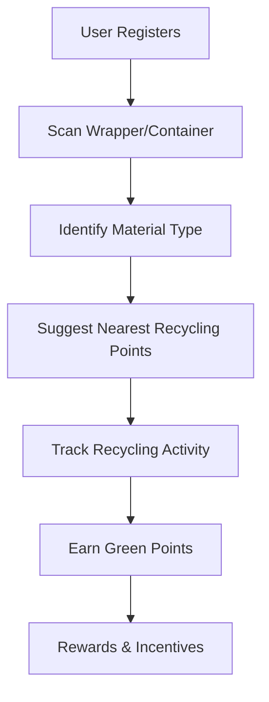

#Greenify

Greenify is an innovative application designed to revolutionize the way we recycle waste wrappers and containers. Created for **Sustain-AI-Thon**, this app leverages cutting-edge technology to encourage and simplify sustainable living by promoting responsible recycling practices.

---

## 📊 Workflow Diagram

  
---

## 🗺️ Concept Map

### Core Features

- User Registration and Login

- AI-Powered Material Recognition

- Geolocation-Based Recycling Center Suggestions

- Activity Tracking and Analytics

- Gamification via Green Points

- Reward System Integration

  

### User Roles

- **Individual Users**

- **Community Groups**

- **Recycling Centers**

- **Corporate Sponsors**

  

### Integration

- QR Code Scanning for Product Identification

- AI Models for Material Detection

- APIs for Geolocation Services

- Wallet System for Points and Rewards

  

---

  

## 🛠️ Tech Stack

- **Frontend**: React Native for a seamless cross-platform experience.

- **Backend**: Node.js with Express for API management.

- **Database**: MongoDB for efficient and scalable data handling.

- **AI/ML**: TensorFlow for material recognition models.

- **APIs**: Google Maps API for geolocation services.

- **Cloud**: AWS for hosting and storage solutions.

  

---

  

## 🌟 Novelty

Greenify stands out for its:

1. **AI-Powered Material Identification**: Ensures accurate recycling suggestions by identifying the material type of scanned items.

2. **Gamification**: Motivates users with a reward system linked to environmental impact.

3. **Community Engagement**: Promotes collaborative recycling efforts by connecting users to local initiatives.

4. **Corporate Integration**: Encourages businesses to participate through sponsorship and reward partnerships.

  

---

  

## 💡 Solution

Greenify addresses the problem of improper waste disposal by:

- Educating users on recyclable materials.

- Simplifying access to recycling centers.

- Encouraging consistent recycling habits through rewards.

- Reducing landfill waste and promoting environmental sustainability.

  

---

  

## 🔍 Others

- **Target Audience**: Urban residents, eco-conscious individuals, and community groups.

- **Sustainability Impact**: Reduction in non-recyclable waste and increased recycling awareness.

- **Future Scope**:

	- Expand to include e-waste recycling.

	- Collaborate with local governments for policy support.

	- Introduce an educational module for schools and colleges.

  

---

  

Greenify aims to create a cleaner, greener planet by combining technology and community efforts to foster sustainable practices. 🌍
